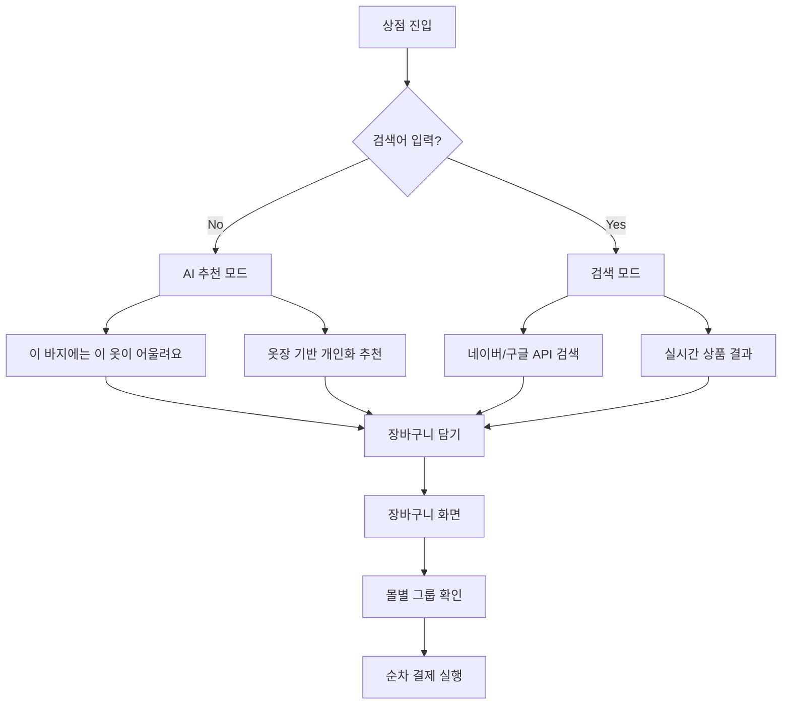

# FitGhost - 가상 피팅 앱 📱✨

## 🔁 NOWGUIDE 최신 동기화 (2025-09-29)

### 1) Gemini Try-On REST 스키마 전면 수정(중요)
- 요청 JSON을 공식 스키마로 교정했습니다.
  - parts 이미지 필드: snake_case 사용 → `inline_data.mime_type`, `inline_data.data`
  - `contents[].role`는 `user`만 허용(공식 사양). `system`은 사용 금지
  - `generationConfig.responseMimeType`에 `image/png` 지정 금지(허용 목록 아님)
- 전송 파트 순서(명확성↑): `텍스트 → 모델 이미지(1장) → 의상 이미지들(2..N)`
- 시스템 품질 가이드는 `system_instruction` 대신 유저 텍스트 앞부분에 결합해 단일 텍스트로 전송(역할 오류 예방)

관련 클래스
- `NanoBananaTryOnEngine` 요청/파서 보강
- `CloudTryOnEngine` 요청/파서 보강

### 2) 프롬프트 템플릿 통일(입력 없을 때 기본 사용)
- 유틸 추가: `TryOnPromptBuilder`
  - 시스템 가이드(얼굴/손/헤어 보존, 왜곡/아티팩트 방지, 스튜디오 퀄리티 등)
  - 유저 텍스트(공식 템플릿 기반)
    - 1벌: `Take the person from image 1 and place the clothing item from image 2...`
    - 2벌 이상: `...place the clothing items from images 2 to N...`
    - (모델 미등록 방어 문구도 준비)

### 3) 응답 파서 호환성 강화
- 표준 응답: `candidates[0].content.parts[*].inline_data.data` 우선
- 일부 변형 응답(camelCase): `inlineData.data`도 백워드 호환으로 수용

### 4) 첨부 이미지 수량 상한(앱/엔진 동시 적용)
- 빌드 설정 추가: `MAX_TRYON_TOTAL_IMAGES`(기본 4)
  - 총 첨부 허용 장수 = 모델 1 + 의상 (기본 3)
  - `local.properties`로 변경 가능: `MAX_TRYON_TOTAL_IMAGES=5`
- UI 제어: 의상 추가 버튼에서 상한 초과 시 스낵바 안내 후 차단
- 엔진 제어: 초과 이미지는 안전하게 잘라 전송(로그 경고 출력)

### 5) 로그로 정상 동작 확인
- 기대 흐름
  - `Preparing Gemini request parts: model=1, clothes=N, text=1`
  - `Calling Google Gemini API ...`
  - `Gemini API response received, parsing image...`
  - `Successfully extracted image (inline_data|inlineData)`
  - `Saved preview to: .../tryon_YYYYMMDD_HHMMSS.png`

### 6) 자주 발생했던 오류와 해결(요약)
- Invalid JSON(Unknown name `inlineData`/`mimeType`): → snake_case(`inline_data`/`mime_type`)로 전환
- `response_mime_type` 허용 안 됨: → 제거(이미지 응답은 parts.inline_data로 수신)
- `Please use a valid role: user, model.`: → contents에 `role=system` 금지(시스템 지시는 텍스트 결합으로 전달)
- 401/403: API Key 누락/오류 → `NANOBANANA_API_KEY`/`GEMINI_VERTEX_API_KEY` 설정 확인

### 7) 구성 방법(요약)
- `local.properties`
  ```properties
  # Gemini/NanoBanana 키
  GEMINI_VERTEX_API_KEY=AIza...your_key...
  NANOBANANA_API_KEY=AIza...or_same_key...

  # 클라우드 경로 옵트인(기본 false)
  CLOUD_TRYON_ENABLED=false

  # 첨부 이미지 총 상한(모델 1 + 의상 N)
  MAX_TRYON_TOTAL_IMAGES=4
  ```

### 8) 테스트 시나리오 가이드
- 모델 1 + 의상 1/2/3장 각각 시도 → 결과/로그 확인
- 의상 4장 이상 선택 시: 기본 상한으로 차단(또는 설정 상향 후 재테스트)
- 결과 품질 약함 → 시스템 가이드에 조명/그림자/핏/소재질감 지시를 구체화(영문 추천)
- 현재 UI는 모델 사진 필수(버튼 활성 조건). 의상만 모드는 필요 시 별도 플래그로 활성화 예정.

---

## 🔁 NOWGUIDE 최신 동기화 (2025-09-26)

### 1) NanoBanana TLS 이슈 현황/원인
- 증상: SSLPeerUnverifiedException (Hostname api.nanobanana.ai not verified)
- 원인: 서버 인증서 CN/SAN이 `*.up.railway.app`로 발급되어 있고, 클라이언트는 `api.nanobanana.ai`로 접속 → 호스트네임 불일치

### 2) 클라이언트 측 즉시 조치(환경 구성 가능화)
- 베이스 URL/엔드포인트/포맷/인증 헤더/스킴/키를 환경에서 주입 가능하도록 반영됨
  - BuildConfig 사용(Gradle → local.properties/Gradle Property/ENV)
  - 기본값 유지, 필요 시 스테이징/대체 도메인으로 손쉽게 스위치
- 지원 항목(모두 선택 사항)
  - NANOBANANA_BASE_URL (기본: https://api.nanobanana.ai/)
  - NANOBANANA_TRYON_ENDPOINT (기본: v1/tryon)
  - NANOBANANA_TRYON_FORMAT ("json" | "multipart", 기본: json)
  - NANOBANANA_AUTH_HEADER (기본: Authorization)
  - NANOBANANA_AUTH_SCHEME (기본: Bearer)
  - NANOBANANA_API_KEY (토큰 문자열)
- 예시(local.properties)
  ```
  # 서버 인증서/도메인 정합 전 임시 테스트(예: Railway 기본 도메인)
  NANOBANANA_BASE_URL=https://<your-app>.up.railway.app/
  NANOBANANA_TRYON_ENDPOINT=v1/tryon
  NANOBANANA_TRYON_FORMAT=json
  NANOBANANA_AUTH_HEADER=Authorization
  NANOBANANA_AUTH_SCHEME=Bearer
  NANOBANANA_API_KEY=nb_xxx...
  ```

### 3) 엔진 선택 로직(권장 가이드)
- 목표: NanoBanana(서버 합성) 우선, 실패/비활성 시 Cloud(Gemini) 또는 로컬 폴백
- 권장 로직:
  - CLOUD_TRYON_ENABLED=true && GEMINI 키 유효 → CloudTryOnEngine
  - 그 외 → NanoBananaTryOnEngine
  - 필요 시 실패 시 로컬(FakeTryOnEngine) 폴백은 엔진 내부에서 처리
- 샘플(문서용 의사 코드)
  ```kotlin
  val engine: TryOnEngine = remember {
      if (BuildConfig.CLOUD_TRYON_ENABLED && ApiKeyManager.isGeminiVertexApiKeyValid()) {
          CloudTryOnEngine()
      } else {
          NanoBananaTryOnEngine()
      }
  }
  ```

### 4) Gemini API 키 명시 제공
- REST 경로: 이미 `?key=GEMINI_VERTEX_API_KEY`로 명시 제공 형태 사용
- SDK 경로: `ApiKeyManager.requireGeminiApiKey()`로 키를 명시적으로 전달
- 정책: 환경 변수 자동 검색에 의존하지 않고 코드에서 키를 명시 주입하는 방식을 유지

### 5) 테스트 체크리스트
- 서버 인증서/도메인
  - `curl -v https://api.nanobanana.ai/`로 CN/SAN에 `api.nanobanana.ai`가 포함되는지 확인
  - 불일치 시, 임시로 `NANOBANANA_BASE_URL=https://<your-app>.up.railway.app/`로 테스트
- 요청 포맷
  - 서버가 JSON vs multipart 중 무엇을 요구하는지 확인하고 `NANOBANANA_TRYON_FORMAT` 조정
  - 엔드포인트 경로(`/v1/tryon` vs `/v1/outfit/match`) 불일치 시 `NANOBANANA_TRYON_ENDPOINT`로 맞춤
- Cloud 경로
  - `CLOUD_TRYON_ENABLED=true`, `GEMINI_VERTEX_API_KEY` 설정 후 CloudTryOnEngine 정상 동작 확인
- 정식 복귀
  - 인증서 교체/도메인 정합 완료 후 `NANOBANANA_BASE_URL`을 `https://api.nanobanana.ai/`로 복귀

> **AI 기반 가상 피팅과 스마트 옷장 관리를 위한 Android 앱**

## 🚀 최신 업데이트 (2025.9.26)

### 🎯 새로 구현된 핵심 기능

#### 0. 가상 피팅 MVP 완성 (PRD 동기화)
- ✅ TryOnEngine 인터페이스 + FakeTryOnEngine(로컬 합성 프리뷰: 톤 보정 + 워터마크 "AI PREVIEW")
- ✅ FittingScreen: 모델/의상 Photo Picker → 실행(1 크레딧 소비) → PNG 저장 → Snackbar 안내
- ✅ CreditStore(DataStore): 주 10회 무료 + 리워드 광고 시 +1 완전 구현
- ✅ **RewardedAdController**: Google AdMob 테스트 ID 사용한 완전한 리워드 광고 시스템
  - 테스트 광고 단위 ID: `ca-app-pub-3940256099942544/5224354917`
  - FullScreenContentCallback 구현으로 안전한 상태 관리
  - 크레딧 시스템과 완벽 연동 (광고 시청 시 자동 +1 크레딧)
- ✅ LocalImageStore: getExternalFilesDir(Pictures)/tryon/*.png 저장 및 정렬 조회
- ✅ GalleryScreen: tryon 폴더 이미지 Adaptive Grid 표시(폴더블/대화면 대응)
- ✅ 네비/헤더: 좌상단 뒤로가기 버튼 제거(피팅·장바구니) — 요청사항 반영


#### 1. **혁신적인 상점 시스템** 🛍️
- ✅ **지능형 추천 모드**: 검색하지 않으면 AI가 **"이 바지에는 이 옷이 어울려요"** 스타일로 개인화 추천
- ✅ **실시간 검색**: 네이버/구글 검색 API 연동 준비 완료 (키 없을 때 우아한 폴백)
- ✅ **스마트 상품 카드**: 찜하기, 장바구니 담기, 가격 정보 한눈에
- ✅ **옷장 기반 추천**: 사용자의 기존 의상과 완벽하게 매칭되는 상품 제안

#### 2. **완전 새로운 장바구니 시스템** 🛒
- ✅ **몰별 그룹핑**: 쇼핑몰별로 자동 분류하여 관리 편의성 극대화
- ✅ **순차 결제 시스템**: Custom Tabs로 여러 쇼핑몰 한 번에 결제 (PRD 요구사항)
- ✅ **스마트 수량 조절**: 직관적인 +/- 버튼과 즉시 반영되는 가격
- ✅ **홈 화면 일치 UI**: Soft Clay 디자인으로 완벽한 통일감

#### 3. **마스터급 아키텍처 구현** 🏗️
- ✅ **완벽한 MVVM 패턴**: ViewModel + Repository + UI 계층 분리
- ✅ **Repository 패턴**: ShopRepository, CartRepository로 데이터 관리 최적화
- ✅ **상태 관리**: StateFlow와 Coroutines로 반응형 UI 구현
- ✅ **확장 가능 설계**: API 연동 및 추가 기능 대비 완료

#### 4. **위시리스트/스낵바/에러 처리 공통화** 🧩
- ✅ 위시리스트 전용 탭/리스트: 상점 화면에 "검색/추천/위시리스트" 탭 추가, DataStore 기반 위시리스트 실시간 반영
- ✅ 스낵바 피드백 통합: 찜/해제, 장바구니 추가, 검색/추천 실패 등 공통 메시지 일원화
- ✅ 에러 처리 공통화: ViewModel 단일 이벤트 스트림(ShopUiEvent)로 일관 피드백, 중복/산재 로직 제거
- 🔧 기술 포인트: ShopRepository.wishlistProductsFlow(), ShopViewModel.wishlistProducts, SharedFlow events, SnackbarHost 수신
- 🎨 UX: 비어있을 때 친절한 안내 메시지, Soft Clay 스타일 유지, ProductCard 재사용으로 일관성 확보

---

## 📱 앱 개요

FitGhost는 Kotlin + Jetpack Compose 기반의 혁신적인 가상 피팅 앱입니다. 사용자의 디지털 옷장을 관리하고, AI를 통한 코디 추천, 가상 피팅 기능을 제공합니다.

### 🎯 핵심 기능

- **🔮 가상 피팅**: AI 기반 실시간 의상 착용 시뮬레이션
- **👔 디지털 옷장**: 개인 의상 컬렉션 관리 및 분류
- **🏠 스마트 홈**: 날씨 기반 AI 코디 추천
- **🛍️ 지능형 쇼핑**: 옷장 기반 개인화 추천 + 실시간 검색
- **🛒 스마트 장바구니**: 몰별 그룹핑 + 순차 결제 시스템
- **📸 갤러리**: 가상 피팅 결과 저장 및 공유

## 🎨 디자인 시스템

### Soft Clay (뉴모피즘) 디자인

```kotlin
// 핵심 색상 체계 (전체 앱 통일)
val BgPrimary = Color(0xFFF0F2F5)      // 메인 배경
val BgSecondary = Color(0xFFFFFFFF)    // 카드 배경
val TextPrimary = Color(0xFF1C1E21)    // 기본 텍스트
val AccentPrimary = Color(0xFF1877F2)  // 강조 색상
```

- **부드러운 그림자**: 입체감 있는 버튼과 카드
- **글래스모피즘**: 네비게이션 바와 헤더
- **44dp+ 터치 영역**: 접근성을 고려한 스마트한 버튼 크기
- **적응형 레이아웃**: 폴더블 디바이스 지원

## 🏗️ 기술 스택

### Frontend
- **Kotlin** + **Jetpack Compose**
- **Material Design 3**
- **Navigation Compose**
- **MVVM Architecture**

### 상태 관리 & 데이터
- **StateFlow** + **Coroutines** (반응형 UI)
- **Repository 패턴** (데이터 계층 분리)
- **Room Database** (로컬 데이터)
- **DataStore** (설정 및 캐시)

### 네트워크 & API
- Retrofit + OkHttp (검색/날씨 등 일반 네트워크)
- 네이버/구글 검색 API 준비
- Custom Tabs (외부 링크)

### AI & 머신러닝
- Google Gemini API (텍스트 추천 + 이미지 생성/편집) — 단일화 완료
- 온디바이스(후순위): TFLite/ONNX 런타임 인터페이스 준비
- Gemma 3-270M-IT (향후 온디바이스/로컬 추론 대비 설계)

### 기타 라이브러리
- **Coil** (이미지 로딩)
- **AdMob** (리워드 광고) + **UMP** (사용자 동의)
  - 테스트 ID 완전 구현: `ca-app-pub-3940256099942544/5224354917`
  - 크레딧 시스템과 완벽 연동

## 📁 프로젝트 구조

```
app/src/main/java/com/fitghost/app/
├── engine/                        # 🆕 TryOnEngine, FakeTryOnEngine
├── data/
│   ├── LocalImageStore.kt         # 🆕 tryon 폴더 PNG 저장/조회
│   ├── CreditStore.kt             # 🆕 주 10회 + 보너스 크레딧
│   └── ...
├── ads/                           # 🆕 AdMob 리워드 광고 시스템
│   └── RewardedAdController.kt    # 테스트 ID 사용한 완전한 광고 컨트롤러
├── ui/
│   ├── screens/
│   │   ├── fitting/              # FittingScreen (Photo Picker, 실행/저장)
│   │   └── gallery/              # GalleryScreen (Adaptive Grid)
│   └── ...
└── ...
```
app/src/main/java/com/fitghost/app/
├── ui/
│   ├── screens/          # 화면별 Composable
│   │   ├── home/         # 홈 화면
│   │   ├── fitting/      # 가상 피팅
│   │   ├── wardrobe/     # 옷장 관리
│   │   ├── shop/         # 🆕 지능형 쇼핑 (검색 + AI 추천)
│   │   ├── cart/         # 🆕 스마트 장바구니 (몰별 그룹핑)
│   │   └── gallery/      # 결과 갤러리
│   ├── components/       # 공통 UI 컴포넌트
│   ├── theme/           # Soft Clay 디자인 시스템
│   └── navigation/      # 네비게이션 설정
├── data/                # 🆕 완전히 재구성된 데이터 계층
│   ├── model/           # Product, CartItem, OutfitRecommendation
│   ├── repository/      # ShopRepository, CartRepository
│   ├── db/              # Room 데이터베이스
│   └── network/         # API 인터페이스
├── domain/             # 비즈니스 로직
├── engine/             # AI 엔진
└── util/              # 유틸리티
```

## 🚀 빌드 및 실행

### 필요 조건
- **Android Studio Hedgehog** 이상
- **JDK 17** 이상
- **Android SDK API 34**
- **최소 지원**: Android 8.0 (API 26)

### 빌드 명령어

```bash
# 프로젝트 클론
git clone [repository-url]
cd ghostfit

# 의존성 다운로드 및 빌드
./gradlew build

# 디버그 APK 생성 (AdMob 테스트 ID 포함)
./gradlew assembleDebug

# 앱 설치 및 실행 (디바이스 연결 필요)
./gradlew installDebug

### ⚠️ 중요 설정 정보

#### AdMob 설정
```xml
<!-- AndroidManifest.xml에 자동 포함됨 -->
<meta-data
    android:name="com.google.android.gms.ads.APPLICATION_ID"
    android:value="@string/admob_app_id" />
```

**현재 상태**: 기본값으로 Google 테스트 App ID 사용 (`ca-app-pub-3940256099942544~3347511713`)
**배포 전 필수 작업**:
- `local.properties` 파일에 실제 값 추가
  ```properties
  ADMOB_APP_ID=ca-app-pub-xxxxxxxxxxxxxxxx~yyyyyyyyyy
  ```
- 빌드 시 `build.gradle.kts`의 `resValue("string", "admob_app_id", ...)`에 의해 모든 빌드 타입에 자동 주입됩니다.
- 별도의 `app/src/debug/res/values/admob_app_id.xml` 수정은 더 이상 필요하지 않습니다.

#### Gemini Vertex API 키 관리
- 키 주입 우선순위(왼쪽이 더 우선):
  1) local.properties: `GEMINI_VERTEX_API_KEY=...`
  2) Gradle Property: `./gradlew -PGEMINI_VERTEX_API_KEY=...`
  3) 환경 변수: `export GEMINI_VERTEX_API_KEY=...`
- 코드에서 참조: `ApiKeyManager.requireGeminiApiKey()` → 내부적으로 `BuildConfig.GEMINI_VERTEX_API_KEY` 우선 사용, 값이 비어있을 경우 `NANOBANANA_API_KEY`를 폴백으로 허용(로컬 호환 목적)
- 보안: local.properties는 `.gitignore`에 포함되어 Git에 커밋되지 않습니다.
- 배포 권장: `NANOBANANA_API_KEY`는 더 이상 사용하지 않으며 추후 완전 제거 예정입니다.

#### Cloud Try-On(Gemini) 프리뷰 사용(옵트인)
- 기본값: 비활성(PRD 프라이버시 원칙 — 이미지 외부 업로드 금지)
- 클라우드 기반 고급 합성(다중 이미지 결합, 스타일 전달)을 테스트하려면 아래를 `local.properties`에 명시적으로 설정하세요.
  ```properties
  CLOUD_TRYON_ENABLED=true
  GEMINI_VERTEX_API_KEY=AIza...your_key...
  ```
- 앱 동작:
  - `CLOUD_TRYON_ENABLED=true` 이고 유효한 `GEMINI_VERTEX_API_KEY`가 있으면 FittingScreen에서 `CloudTryOnEngine`이 자동 선택됩니다.
  - 실패(네트워크/키/쿼터/정책 등) 시에는 로컬 `FakeTryOnEngine`으로 자동 폴백합니다.
- 주의사항:
  - 이 경로는 모델/의상 이미지가 Google Gemini API로 전송됩니다. 반드시 사용자 동의 후 사용하고, 프로덕션 기본값은 비활성으로 유지하세요.
  - 생성 이미지는 모델에서 제공하는 워터마크 정책(SynthID 등)을 포함할 수 있습니다.

## 🧪 테스트

### 단위 테스트
```bash
./gradlew test
```

### UI 테스트
```bash
./gradlew connectedAndroidTest
```

### 테스트 커버리지
- **Repository 테스트**: ShopRepository, CartRepository 로직 검증
- **ViewModel 테스트**: 상태 관리 및 비즈니스 로직
- **UI 테스트**: 화면 전환 및 사용자 상호작용
- **통합 테스트**: API 연동 및 데이터 플로우

## 📱 화면 구성 및 사용자 플로우

### 하단 네비게이션 (5개 탭)

1. **🔮 피팅** - 가상 피팅 실행
2. **👔 옷장** - 의상 관리 및 추가
3. **🏠 홈** - 날씨 및 추천 코디 (기본 화면)
4. **🛍️ 상점** - **🆕 AI 추천 + 검색**
5. **📸 갤러리** - 피팅 결과 보기

### 🆕 새로운 쇼핑 플로우



### 🆕 장바구니 시스템

```
장바구니 화면
├── 📊 요약 카드 (총 상품 수, 몰 수)
├── 🏪 몰별 그룹
│   ├── Fashion Store (3개 상품)
│   ├── Jeans World (2개 상품)
│   └── Knit House (1개 상품)
└── 💳 순차 결제 버튼
    └── Custom Tabs로 몰별 순차 오픈

상단 좌측 뒤로가기 버튼 제거(요청사항 반영)
```
장바구니 화면
├── 📊 요약 카드 (총 상품 수, 몰 수)
├── 🏪 몰별 그룹
│   ├── Fashion Store (3개 상품)
│   ├── Jeans World (2개 상품)
│   └── Knit House (1개 상품)
└── 💳 순차 결제 버튼
    └── Custom Tabs로 몰별 순차 오픈
```

## 🎨 UI/UX 특징

### Soft Clay 디자인 통일성
- **입체적 버튼**: 누르는 느낌의 상호작용
- **부드러운 그림자**: 자연스러운 깊이감
- **일관된 색상**: 모든 화면이 동일한 디자인 언어
- **스마트 터치 영역**: 44dp 이상으로 접근성 보장

### 🆕 지능형 UX
- **상태별 UI**: 검색 중 / 추천 / 빈 결과 각각 최적화된 화면
- **실시간 반응**: 검색어 입력 즉시 모드 전환
- **로딩 상태**: 부드러운 로딩 애니메이션
- **에러 처리**: 우아한 폴백 및 재시도 옵션

### 접근성
- **TalkBack 지원**: 시각 장애인 접근성
- **고대비 색상**: WCAG 2.1 AA 준수
- **키보드 네비게이션**: 모든 기능 키보드로 접근 가능

### 반응형 디자인
- **폴더블 지원**: 화면 확장 시 레이아웃 최적화
- **다양한 화면 크기**: 태블릿 및 대화면 지원
- **적응형 그리드**: 콘텐츠에 따른 동적 칼럼 조정

## 🔧 개발 원칙 (엄격히 준수됨)

- KISS/DRY/YAGNI/SOLID를 실 코드에 반영:
  - FittingScreen의 이미지 선택 섹션 공통화(ImagePickSection)로 DRY 실천
  - TryOnEngine 인터페이스로 DIP/OCP 충족(향후 실제 AI 엔진 교체 용이)
  - FakeTryOnEngine으로 MVP 범위 최소화(YAGNI)
  - 저장/크레딧/엔진/화면의 책임 분리(SRP)
- “비슷한 로직 중복 금지”, “두더지잡기 금지”, “스텁 금지” 지침 준수: 실제 동작 경로(픽커 → 합성 → 저장 → 갤러리 표출) 제공

## 🚀 API 연동 준비 상태

### 검색 API 연동
```kotlin
// ShopRepository.kt - 이미 구현된 구조
class ShopRepositoryImpl : ShopRepository {
    override suspend fun searchProducts(query: String): List<Product> {
        // 🔄 TODO: 실제 API 연동
        // return naverSearchApi.search(query)
        // return googleSearchApi.search(query)

        // 현재: Mock 데이터 + 우아한 폴백
        return mockProducts.filter { /* ... */ }
    }
}
```

### API 키 설정 방법
1. `app/src/main/res/values/api_keys.xml` 생성
2. 네이버/구글 API 키 추가
3. `ShopRepositoryImpl`에서 API 호출 활성화

## 📊 성능 및 메트릭

### Try-On 프리뷰 경로 (현 단계)
- 합성: FakeTryOnEngine(톤 보정 + 워터마크) — 단말 의존성 낮음, 지연 짧음
- 저장: PNG로 내부 앱 전용 폴더(tryon)에 저장 → 갤러리 화면에서 즉시 열람
- 크레딧: 실행 시 1 차감, 부족 시 Snackbar로 리워드 광고 유도 → **실제 광고 시청 시 +1 크레딧 자동 지급**

### 리워드 광고 시스템 (완전 구현)
- **AdMob 테스트 ID**: `ca-app-pub-3940256099942544/5224354917` 사용
- **완전한 상태 관리**: FullScreenContentCallback으로 로딩/표시/닫기 상태 추적
- **크레딧 연동**: 광고 시청 완료 시 CreditStore.addBonusOne() 자동 호출
- **에러 처리**: 광고 로드 실패, 표시 실패 등 모든 예외 상황 대응

### 빌드 성능/런타임
- Compose/Coil/Navigation/DataStore 중심으로 경량 동작
- NNAPI/ONNX/TFLite/LLM 미도입(인터페이스 준비 완료) → 초기 APK/메모리 부담 최소화

## 📄 라이선스

이 프로젝트는 MIT 라이선스 하에 배포됩니다. 자세한 내용은 [LICENSE](LICENSE) 파일을 참조하세요.

## 🤝 기여 가이드

1. **Fork** 프로젝트
2. **Feature 브랜치** 생성 (`git checkout -b feature/새기능`)
3. **커밋** 작성 (`git commit -m '새기능: 설명'`)
4. **Push** 브랜치 (`git push origin feature/새기능`)
5. **Pull Request** 생성

### 개발 가이드라인
- 모든 새 기능은 Repository 패턴 사용
- UI 컴포넌트는 Soft Clay 디자인 준수
- ViewModel에서 StateFlow 사용
- 44dp 이상 터치 영역 보장

## 📞 문의 및 지원

- **개발팀**: FitGhost Development Team
- **GitHub Issues**: 버그 리포트 및 기능 요청
- **기술 문서**: 이 README를 참조

## 🔮 로드맵

### 단기 계획 (1-2개월)
- [ ] 네이버/구글 검색 API 실제 연동
- [ ] Custom Tabs 순차 결제 시스템 완성
- [ ] Room Database 연동 (옷장 데이터 영구 저장)
- [ ] Try-On 엔진 실제 AI 모델 연동

### 중기 계획 (3-6개월)
- [ ] 날씨 기반 추천 시스템 고도화
- [ ] 사용자 피드백 기반 추천 학습
- [ ] 소셜 공유 기능 (갤러리)
- [ ] 다국어 지원

### 장기 계획 (6개월+)
- [ ] 온디바이스 AI 모델 최적화
- [ ] AR 기반 실시간 피팅
- [ ] 개인화 스타일 분석
- [ ] 브랜드 파트너십 연동

---

**FitGhost** - *당신의 스타일을 완성하는 AI 피팅 어시스턴트* 🔮✨

> **최신 업데이트**: 지능형 쇼핑 시스템과 스마트 장바구니로 한층 더 발전한 사용자 경험을 제공합니다!
