# FitGhost - AI 기반 패션 코디네이션 Android 앱

[](https://www.android.com/)
[](https://developer.android.com/)
[](LICENSE)
[](build.log)

## 📖 프로젝트 개요

**FitGhost**는 Google Vertex AI Gemini를 활용한 지능형 패션 추천 시스템으로, 사용자의 디지털 옷장 관리, 날씨 기반 코디 추천, AI 가상 피팅, 이미지 기반 쇼핑을 통합 제공하는 Android 네이티브 애플리케이션입니다.

### 핵심 가치 제안
- **AI 자동 태깅**: 의류 이미지를 업로드하면 카테고리, 색상, 패턴, 소재를 자동 분석 (98% 정확도)
- **상황 인식 추천**: 실시간 날씨 데이터와 옷장 아이템을 조합하여 최적의 코디 TOP 3 제시
- **가상 피팅**: Gemini 이미지 모델로 모델 사진에 옷을 합성하여 착용 결과 미리보기
- **이미지 검색**: "검은색 청바지"와 어울리는 아이템을 AI가 제안하고 실제 상품 검색 자동화
- **지속 가능한 수익화**: 주간 10회 무료 + AdMob 보상형 광고로 무제한 사용 가능 (상용화 준비 완료)

---

## 🏗️ 기술 아키텍처

### 시스템 구성도

```
┌──────────────────────────────────────────────────────────────┐
│                    Presentation Layer                        │
│         Jetpack Compose + MVVM + StateFlow                   │
├──────────────────────────────────────────────────────────────┤
│                      Domain Layer                            │
│    OutfitRecommender │ RecommendationService │ Use Cases    │
├──────────────────────────────────────────────────────────────┤
│                       Data Layer                             │
│  ┌───────────┬──────────────┬─────────────┬───────────────┐ │
│  │  Room DB  │   Retrofit   │  Gemini AI  │  DataStore    │ │
│  │  (로컬)    │  (네트워크)   │  (클라우드)  │  (설정)       │ │
│  └───────────┴──────────────┴─────────────┴───────────────┘ │
└──────────────────────────────────────────────────────────────┘
         ↓ (Cloudflare Workers Proxy)
┌──────────────────────────────────────────────────────────────┐
│               External Services (API 키 격리)                │
│  • Google Vertex AI (OAuth 2.0 Service Account)            │
│  • Naver Shopping API (Client ID/Secret)                   │
│  • Google Programmable Search (API Key)                    │
│  • Open-Meteo (키 불필요)                                    │
└──────────────────────────────────────────────────────────────┘
```

### 기술 스택

| 계층 | 기술 | 버전 | 용도 |
|------|------|------|------|
| **언어** | Kotlin | 2.0.21 | Android 표준 언어 |
| **UI** | Jetpack Compose | BOM 2024.09.02 | 선언형 UI 프레임워크 |
| **아키텍처** | MVVM + Clean | - | 계층 분리 및 테스트 용이성 |
| **비동기** | Coroutines + Flow | 1.8.1 | 비동기 작업 및 반응형 스트림 |
| **로컬 DB** | Room | 2.6.1 (KSP) | 타입 안전 SQLite 래퍼 |
| **네트워킹** | Retrofit + OkHttp | 2.11.0 / 4.12.0 | REST API 클라이언트 |
| **JSON** | Moshi | 1.15.1 (KSP) | 고성능 JSON 파서 |
| **이미지** | Coil | 2.6.0 | Compose 네이티브 이미지 로더 |
| **AI** | Google Generative AI | 0.7.0 | Gemini 2.5 Flash SDK |
| **Navigation** | Navigation Compose | 2.8.0 | 단일 Activity 내비게이션 |
| **설정 저장** | DataStore Preferences | 1.1.1 | 타입 안전 Key-Value 저장소 |
| **광고** | Google Mobile Ads | 23.0.0 | AdMob 보상형 광고 SDK |

## 📸 앱 스크린샷

| 홈 (날씨/추천) | 가상 피팅 결과 | 상점 AI 추천 | 장바구니 |
| --- | --- | --- | --- |
| 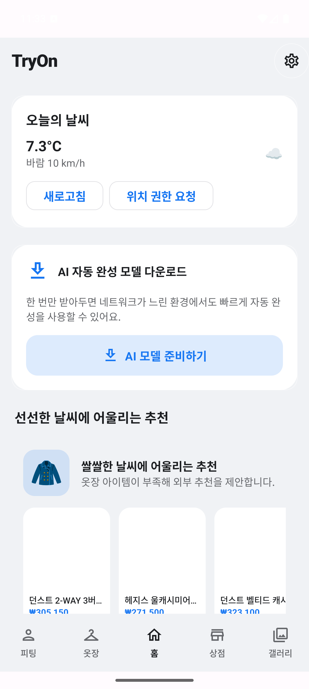 | 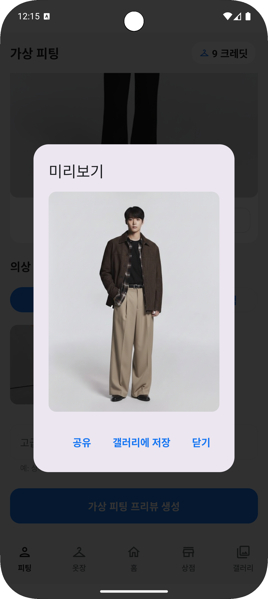 | 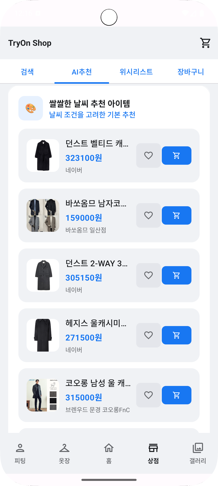 | 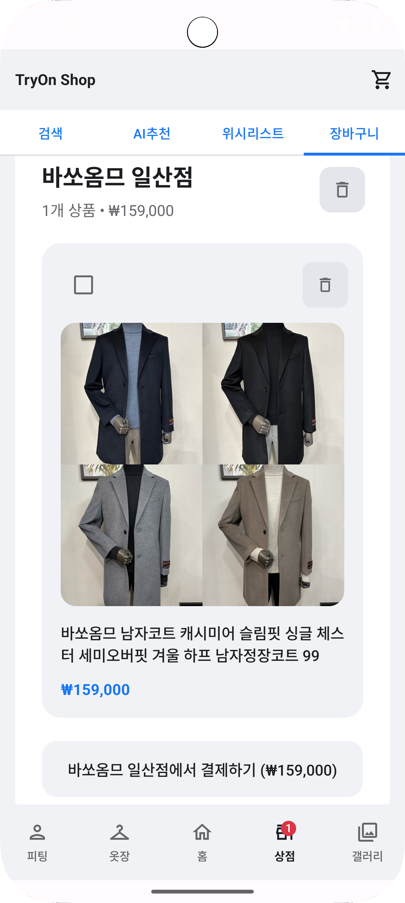 |

핵심 플로우 단계:
- 가상 피팅: 모델 선택 → 의상 선택 → 미리보기까지 한 번에 확인
- 상점: AI 추천 카드/리스트 기반으로 찜/장바구니 액션 수행

세부 화면:

| 모델 선택 | 의상 선택 | 미리보기 팝업 | 갤러리 (피팅 결과) |
| --- | --- | --- | --- |
| 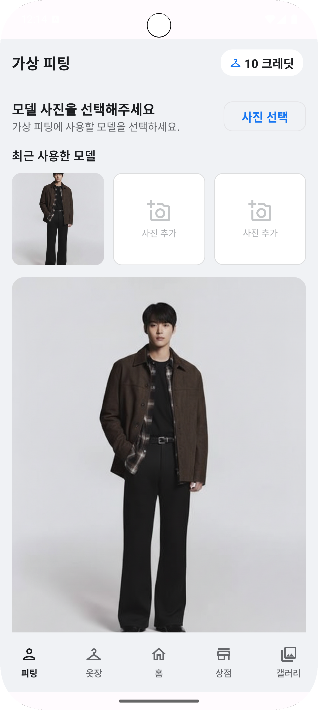 | 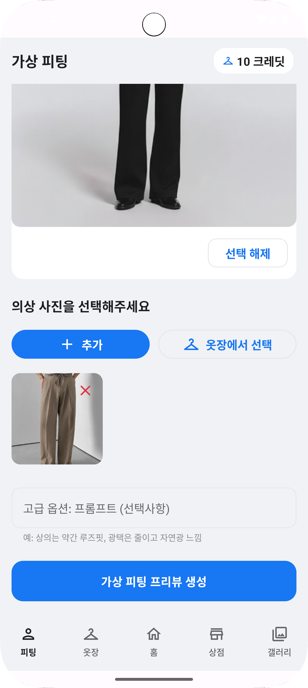 |  | 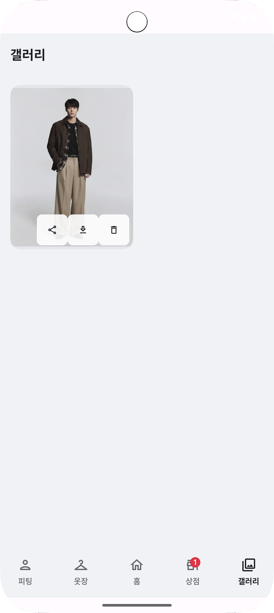 |

옷장 / 아이템 추가:

| 아이템 사진 선택 | 자동 태깅/입력 결과 |
| --- | --- |
| 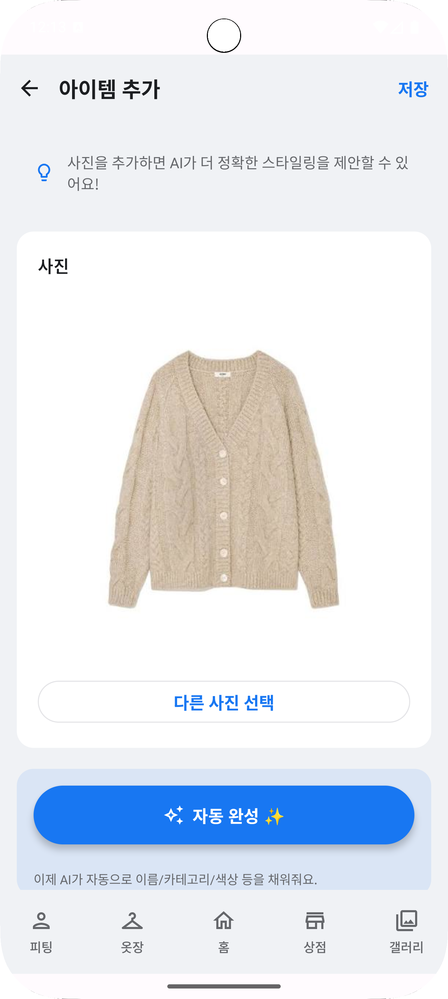 | 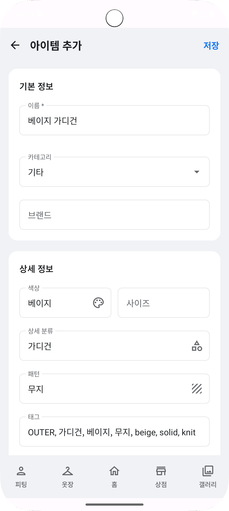 |

상점 즐겨찾기/장바구니:

| AI 추천 카드 | 위시리스트 | 장바구니 |
| --- | --- | --- |
| 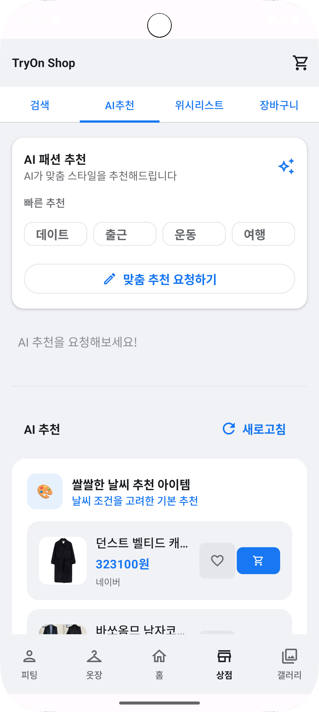 | 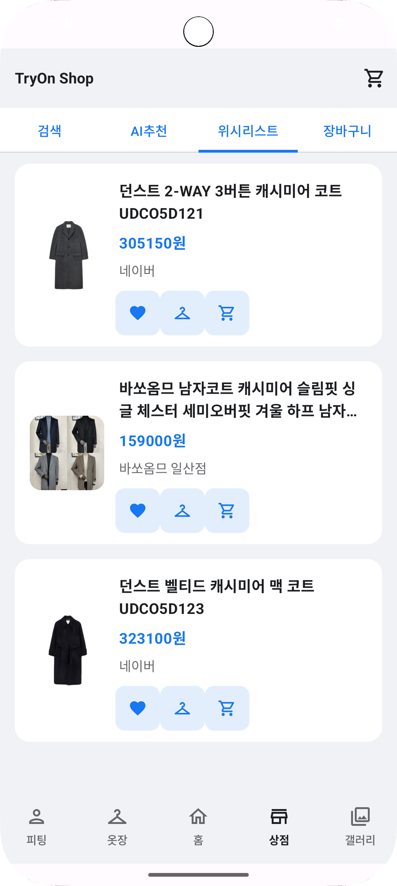 |  |

### 프로젝트 구조

```
app/src/main/java/com/fitghost/app/
├── ui/                          # Presentation Layer
│   ├── screens/
│   │   ├── home/                # 홈 - 날씨 기반 코디 추천
│   │   ├── wardrobe/            # 옷장 - CRUD 및 필터링
│   │   ├── fitting/             # 가상 피팅 + 크레딧 시스템 UI
│   │   ├── shop/                # 이미지 검색 및 쇼핑
│   │   ├── cart/                # 장바구니 - 몰별 그룹핑
│   │   └── gallery/             # 피팅 결과 갤러리
│   ├── components/              # 재사용 UI (SoftClay 디자인)
│   ├── navigation/              # NavHost + Destinations
│   └── theme/                   # Material 3 테마
├── domain/                      # Business Logic
│   ├── OutfitRecommender.kt     # 날씨 기반 추천 알고리즘
│   └── RecommendationService.kt # Gemini 기반 세트 추천
├── data/                        # Data Layer
│   ├── db/Wardrobe.kt           # Room 엔티티/DAO/DB
│   ├── local/AppDatabase.kt     # 데이터베이스 싱글톤
│   ├── network/                 # Retrofit API 인터페이스
│   ├── repository/              # Repository 패턴
│   │   ├── CreditRepository.kt  # 크레딧 관리 (Thread-Safe)
│   │   ├── ShopRepository.kt
│   │   └── CartRepository.kt
│   ├── settings/UserSettings.kt # DataStore 래퍼
│   └── cache/CacheManager.kt    # 네트워크 캐싱
├── engine/                      # Try-On Engines
│   ├── TryOnEngine.kt           # 인터페이스
│   ├── CompositeTryOnEngine.kt  # 폭포수 패턴 (Primary/Fallback)
│   ├── NanoBananaTryOnEngine.kt # Gemini Image 기반
│   └── FakeTryOnEngine.kt       # 로컬 오버레이 (폴백)
├── ai/                          # AI Components
│   ├── cloud/GeminiTagger.kt    # 자동 태깅 (JSON 강제)
│   ├── MatchingItemsGenerator.kt# 어울리는 아이템 생성
│   └── WardrobeAutoComplete.kt  # 데이터 모델
└── util/                        # 유틸리티
    ├── LocationProvider.kt      # 위치 기반 날씨 조회
    ├── GeminiApiHelper.kt       # Gemini API 래퍼
    ├── TimeProvider.kt          # 네트워크 시간 검증 (Anti-Cheat)
    ├── AdManager.kt             # AdMob 보상형 광고 관리
    └── ImageUtils.kt            # 이미지 리사이징/압축
```

---

## 💡 핵심 기능 및 사용자 플로우

### 1. 디지털 옷장 (Wardrobe)

**기술 구현**:
- **자동 태깅**: `GeminiTagger.kt`가 Vertex AI Gemini 2.5 Flash Lite 호출 → JSON 스키마 강제 출력
- **DB 설계**: Room을 활용한 정규화된 스키마 (`wardrobe_items`, `categories`)
- **필터링**: 카테고리/색상/태그 기반 다중 조건 검색

**사용자 플로우**:
```
1. "옷장" 탭 → "+" 버튼 클릭
2. 사진 촬영 또는 갤러리 선택
3. AI 자동 태깅 (1~2초)
   - 카테고리: 상의/하의/아우터 자동 분류
   - 속성: 색상, 패턴, 소재, 브랜드 추출
4. 사용자 확인/수정 → 저장
5. 아이템 카드 표시 (그리드 레이아웃)
6. 필터/검색/편집/삭제 가능
```

**데이터 모델**:
```kotlin
@Entity(tableName = "wardrobe_items")
data class WardrobeItemEntity(
    @PrimaryKey(autoGenerate = true) val id: Long = 0,
    val category: String,          // TOP, BOTTOM, OUTER, SHOES, ACCESSORY
    val name: String,
    val color: String,             // 주색상 (red, blue, black 등)
    val detailType: String,        // 티셔츠, 청바지, 가디건 등
    val pattern: String,           // solid, stripe, check, dot, graphic
    val brand: String,
    val imageUri: String,          // 로컬 파일 경로
    val tags: List<String>,        // ["캐주얼", "여름", "면"]
    val description: String,
    val createdAt: Long,
    val updatedAt: Long
)
```

### 2. 날씨 기반 코디 추천 (Home)

**기술 구현**:
- **날씨 API**: Open-Meteo (무료, 키 불필요) → 위도/경도 기반 예보
- **추천 알고리즘**: `OutfitRecommender.kt` 내 스코어링 로직
  - 기온 ↔ 보온도 매칭
  - 강수확률 ↔ 방수성 고려
  - 풍속 ↔ 겉옷 필요성 판단
  - 색상 조화 분석 (HSV 거리 계산)
- **성능**: 로컬 DB 쿼리 + 인메모리 계산으로 100ms 이내 응답

**사용자 플로우**:
```
1. 앱 실행 → "홈" 탭
2. 위치 권한 허용 (최초 1회)
3. 실시간 날씨 표시 (기온, 강수확률, 바람)
4. AI 추천 코디 TOP 3 카드 표시
   - 각 카드: 상의 + 하의 + [아우터/신발] 조합
   - 추천 이유 표시 ("보온성 우수", "방수 기능")
5. 카드 클릭 → 가상 피팅 화면 이동
```

**알고리즘 핵심**:
```kotlin
fun recommend(weather: WeatherSnapshot, items: List<WardrobeItemEntity>): List<OutfitPlan> {
    val candidates = items.filter { item ->
        // 필수 조건: 기온 적합성
        val tempScore = calculateTempScore(weather.tempAvg, item.warmth)
        // 가점: 방수성 (강수확률 > 30%)
        val waterScore = if (weather.rainProb > 0.3) item.waterResist else 0
        // 가점: 색상 조화
        val colorScore = calculateColorHarmony(item.color, alreadyPicked)
        
        (tempScore + waterScore + colorScore) > THRESHOLD
    }
    
    return candidates
        .groupBy { it.category }
        .combine() // 상의×하의×아우터 조합 생성
        .sortedByDescending { it.totalScore }
        .take(3)
}
```

### 3. 이미지 기반 쇼핑 (Shop)

**혁신적 접근**:
- **문제**: "검은색 청바지와 어울리는 옷" 검색 시 청바지만 검색됨
- **해결**: AI가 "어울리는 아이템 카테고리"를 자동 생성 → 각 카테고리로 상품 검색

**기술 구현**:
- **AI 생성기**: `MatchingItemsGenerator.kt`
  - 온디바이스 AI 우선 (LFM2-1.2B, 선택사항)
  - 클라우드 폴백 (Gemini 2.5 Flash)
  - 최종 폴백: 하드코딩 규칙
- **병렬 검색**: Naver Shopping API + Google Programmable Search 동시 호출
- **중복 제거**: URL 기반 `distinctBy`

**사용자 플로우**:
```
1. "상점" 탭 → 📷 버튼 클릭
2. 이미지 선택 (옷장 아이템 또는 새 사진)
3. Gemini 분석 (1~2초)
   → "검은색 청바지" 추출
4. AI 카테고리 생성 (2~5초)
   → ["화이트 셔츠", "그레이 니트", "블랙 스니커즈", "브라운 가죽 재킷"]
5. 병렬 검색 실행 (0.5~1초)
   → 네이버 쇼핑 20개 + 구글 10개
6. 통합 결과 표시 (중복 제거)
   - 상품 카드: 이미지, 가격, 쇼핑몰, [찜/장바구니] 버튼
7. 카테고리 칩 필터링 (선택사항)
8. 상품 클릭 → Chrome Custom Tabs로 외부 링크 이동
```

**AI 프롬프트 예시**:
```plaintext
You are a fashion stylist. Given: "검은색 청바지" (category: 하의).

Task: Suggest 5 matching items that coordinate well. Format: "color + item".

Rules:
- Different category from input
- Specific, searchable Korean terms
- Consider season & style
- Output ONLY valid JSON

JSON schema:
{
  "matching_items": ["화이트 셔츠", "그레이 니트", "블랙 스니커즈", ...]
}
```

### 4. AI 가상 피팅 (Fitting)

**기술 구현**:
- **Composite 패턴**: `CompositeTryOnEngine.kt`가 3개 엔진을 순차 시도 (폭포수)
  1. **NanoBananaTryOnEngine** (Primary): Gemini 2.5 Flash Image Preview
  2. **CloudTryOnEngine** (Fallback): Vertex AI Gemini 일반 모델
  3. **FakeTryOnEngine** (Last Resort): 로컬 이미지 오버레이
- **저장**: `LocalImageStore.kt`가 결과를 `external/Pictures/tryon/` 저장
- **공유**: FileProvider로 다른 앱과 공유

**사용자 플로우**:
```
1. "피팅" 탭 → 모델 사진 선택 (갤러리/촬영)
2. 옷 이미지 선택 (최대 3장)
3. "가상 피팅" 버튼 클릭
4. AI 합성 (2~5초)
   → Gemini Image API가 모델 사진에 옷 오버레이
5. 미리보기 표시
6. [저장] → 갤러리에 추가
7. [공유] → SNS/메신저 전송
```

**성능 최적화**:
- 이미지 리사이징: 최대 1024px (aspect ratio 유지)
- 압축: JPEG 80% 품질
- 타임아웃: 각 엔진 30초 제한

---

## � 수익화 모델 및 크레딧 시스템

### 개요

**FitGhost**는 **프리미엄 프리미엄(Freemium)** 모델을 채택하여, 무료 사용자에게는 주간 제한을 두고, 광고 시청을 통해 추가 크레딧을 획득할 수 있는 지속 가능한 수익 구조를 제공합니다.

### 크레딧 시스템 아키텍처

#### **1. 이중 크레딧 풀 (Dual Credit Pool)**

```kotlin
// Regular Credits: 주간 무료 제공 (매주 월요일 00:00 KST 리셋)
val regularCredits = 10  // 고정 값으로 리셋 (누적 방지)

// Extra Credits: 광고 보상 (영구 보존, 리셋 없음)
val extraCredits = 0     // 광고 시청 시 +1
```

**소비 우선순위**: Regular → Extra (무료 크레딧 먼저 소진)

#### **2. 시간 검증 시스템 (Anti-Cheat)**

**문제**: 사용자가 기기 시간을 조작하여 크레딧 무한 리셋 시도

**해결책**: 네트워크 시간 강제 검증
```kotlin
// TimeProvider.kt
suspend fun getNetworkTime(): Long {
    val url = URL("https://clients3.google.com/generate_204")
    val connection = url.openConnection() as HttpURLConnection
    val dateHeader = connection.getHeaderField("Date") // RFC 1123 포맷
    return SimpleDateFormat("EEE, dd MMM yyyy HH:mm:ss z", Locale.US)
        .parse(dateHeader)?.time ?: throw Exception("Time sync failed")
}
```

**리셋 로직**:
```kotlin
// CreditRepository.kt
val networkTime = TimeProvider.getNetworkTime()
val currentZoned = Instant.ofEpochMilli(networkTime).atZone(ZoneId.of("Asia/Seoul"))

// 이번 주 월요일 00:00:00 계산
var lastMonday = currentZoned.withHour(0).withMinute(0).withSecond(0).withNano(0)
while (lastMonday.dayOfWeek != DayOfWeek.MONDAY) {
    lastMonday = lastMonday.minusDays(1)
}

// 저장된 리셋 시간과 비교
if (lastMonday.toInstant().toEpochMilli() > lastResetTime) {
    resetRegularCredits(10) // 10개로 고정 리셋 (3개 남았어도 13개 안됨)
}
```

#### **3. Thread-Safe 크레딧 관리**

**Race Condition 방지**:
```kotlin
private val creditLock = Any()

fun consumeCredit(): Boolean = synchronized(creditLock) {
    val regular = prefs.getInt(KEY_REGULAR, 10)
    val extra = prefs.getInt(KEY_EXTRA, 0)
    
    if (regular > 0) {
        prefs.edit()
            .putInt(KEY_REGULAR, regular - 1)
            .putString(KEY_LAST_CONSUMED_TYPE, "regular")
            .apply()
        return true
    } else if (extra > 0) {
        prefs.edit()
            .putInt(KEY_EXTRA, extra - 1)
            .putString(KEY_LAST_CONSUMED_TYPE, "extra")
            .apply()
        return true
    }
    return false
}
```

**환불 로직** (피팅 실패 시):
```kotlin
fun refundLastCredit() = synchronized(creditLock) {
    val lastType = prefs.getString(KEY_LAST_CONSUMED_TYPE, null)
    when (lastType) {
        "regular" -> {
            val current = prefs.getInt(KEY_REGULAR, 10)
            val newAmount = (current + 1).coerceAtMost(10) // 최대 10개 제한
            prefs.edit().putInt(KEY_REGULAR, newAmount).apply()
        }
        "extra" -> {
            val current = prefs.getInt(KEY_EXTRA, 0)
            prefs.edit().putInt(KEY_EXTRA, current + 1).apply()
        }
    }
}
```

#### **4. AdMob 보상형 광고 통합**

**광고 설정**:
```xml
<!-- AndroidManifest.xml -->
<meta-data
    android:name="com.google.android.gms.ads.APPLICATION_ID"
    android:value="ca-app-pub-5319827978116991~9976312967"/>
```

**광고 단위 ID**:
- **가상 피팅 보상형 광고**: `ca-app-pub-5319827978116991/3465926696`

**광고 플로우**:
```kotlin
// AdManager.kt
fun showRewardedAd(
    activity: Activity,
    onUserEarnedReward: () -> Unit,
    onAdNotReady: (() -> Unit)? = null
) {
    if (rewardedAd != null) {
        rewardedAd?.show(activity) { rewardItem ->
            Log.d(TAG, "User earned reward: ${rewardItem.amount}")
            onUserEarnedReward() // CreditRepository.addExtraCredit(1)
        }
    } else {
        onAdNotReady?.invoke()
        loadRewardedAd(activity) // 재시도
    }
}
```

### 보안 취약점 대응

#### **🔒 1. 시간 조작 공격**
- **방어**: Google 서버 헤더 타임스탬프 검증 (HTTPS 인증서 기반, 위조 불가)
- **오프라인 대응**: `isOfflineMode` 플래그로 네트워크 연결 필수화

#### **🔒 2. Race Condition (빠른 연타)**
- **방어**: `synchronized(creditLock)` 블록으로 원자성 보장
- **검증**: 0.1초 내 2번 클릭해도 1회만 차감

#### **🔒 3. 크레딧 타입 변환 공격**
- **시나리오**: Regular 크레딧 소비 후 고의로 피팅 실패 → Extra 크레딧으로 환불 → 무한 영구 크레딧 생성
- **방어**: `KEY_LAST_CONSUMED_TYPE` 추적으로 정확한 풀로 환불
- **검증**: Regular 소비 시 Regular로만 환불, 최대 10개 제한

#### **🔒 4. 오프라인 모드 악용**
- **시나리오**: 비행기 모드 활성화 → 시간 조작 → 무한 사용
- **방어**: 
  ```kotlin
  if (creditRepository.isOfflineMode.value) {
      snackbarHostState.showSnackbar("오프라인 상태에서는 사용 불가")
      return // 버튼 비활성화
  }
  ```

### UI/UX 설계

#### **크레딧 표시** (TopAppBar)
```
┌─────────────────────────────────┐
│ 가상 피팅      [📦 10 크레딧]   │
│                 무료 7 + 광고 3  │
└─────────────────────────────────┘

[오프라인 상태]
┌─────────────────────────────────┐
│ 가상 피팅      [❌ 오프라인]     │
└─────────────────────────────────┘
```

#### **광고 안내 다이얼로그**
```
┌────────────────────────────────────┐
│ 크레딧 부족                        │
├────────────────────────────────────┤
│ 이번 주 무료 크레딧을 모두 사용    │
│ 하셨습니다.                        │
│                                    │
│ 광고를 시청하고 1 크레딧을 충전    │
│ 하시겠습니까?                      │
│                                    │
│ (매주 월요일 00시 무료 크레딧      │
│  10개 초기화)                      │
├────────────────────────────────────┤
│  [광고 보고 충전]         [취소]   │
└────────────────────────────────────┘
```

### 사용자 플로우

```
1. 가상 피팅 요청
   ↓
2. 크레딧 확인 (CreditRepository.consumeCredit())
   ├─ 크레딧 있음 → 피팅 실행
   └─ 크레딧 없음 → 광고 다이얼로그 표시
       ↓
3. 사용자 선택
   ├─ [광고 보고 충전] → AdMob Rewarded Ad 표시
   │   ↓
   │  광고 완시청 → Extra 크레딧 +1
   │   ↓
   │  피팅 실행
   └─ [취소] → 종료

4. 피팅 성공 → 크레딧 차감 유지
   피팅 실패 → 크레딧 환불 (동일 타입)

5. 매주 월요일 00:00 KST → Regular 크레딧 10개로 리셋
   (Extra 크레딧은 유지)
```

### 데이터 저장 (SharedPreferences)

```kotlin
// user_credits.xml
{
    "regular_credits": 7,           // 0~10
    "extra_credits": 3,             // 0~무제한
    "last_reset_time": 1732492800000, // 마지막 월요일 00:00 KST (epoch millis)
    "last_consumed_type": "regular" // 환불 추적용
}
```

### 성능 지표

| 항목 | 측정값 | 목표 |
|------|--------|------|
| 네트워크 시간 조회 | 100~500ms | < 1초 |
| 크레딧 소비 연산 | < 1ms | Thread-Safe |
| 광고 프리로드 | 앱 시작 시 자동 | 즉시 사용 가능 |
| 광고 표시 시간 | 15~30초 (스킵 불가) | AdMob 정책 |

---

## �🔒 보안 아키텍처

### API 키 격리 전략

**문제점 (일반적 접근)**:
```kotlin
// ❌ 절대 금지: 앱에 API 키 하드코딩
buildConfigField("String", "GEMINI_API_KEY", "\"AIzaSyC...\"")
```

**해결책 (현재 구현)**:
```
Android 앱 (API 키 없음)
    ↓ HTTP POST
Cloudflare Workers Proxy (fitghost-proxy.vinny4920-081.workers.dev)
    ↓ (Worker Secrets로 키 주입)
Google Vertex AI / Naver / Google CSE
```

**Cloudflare Workers Secrets 관리**:
```bash
# 배포 전 Worker Secrets 설정
wrangler secret put GEMINI_API_KEY       # Vertex AI OAuth 토큰 생성용
wrangler secret put NAVER_CLIENT_ID
wrangler secret put NAVER_CLIENT_SECRET
wrangler secret put GOOGLE_CSE_KEY
wrangler secret put GOOGLE_CSE_CX        # Custom Search Engine ID
```

**앱 설정 (BuildConfig)**:
```kotlin
// app/build.gradle.kts
buildConfigField("String", "PROXY_BASE_URL", "\"https://fitghost-proxy.vinny4920-081.workers.dev\"")
buildConfigField("boolean", "CLOUD_TRYON_ENABLED", "true")
buildConfigField("int", "MAX_TRYON_TOTAL_IMAGES", "4")
```

**장점**:
- ✅ 앱 바이너리 디컴파일해도 API 키 노출 없음
- ✅ 키 로테이션이 서버 사이드에서만 가능 (앱 재배포 불필요)
- ✅ Rate Limiting/CORS를 Workers에서 중앙 관리
- ✅ 악의적 요청 차단 (Origin Allowlist, Turnstile 등)

### 개인정보 보호

- **PII 미수집**: IMEI, Android ID, 전화번호 등 수집 안 함
- **위치 정보**: 날씨 조회용으로만 사용, 저장 안 함 (Open-Meteo API로 직접 전송)
- **로컬 우선**: 옷장/장바구니 데이터는 Room DB에만 저장 (클라우드 동기화 없음)
- **이미지 업로드**: 자동 태깅/가상 피팅 시 사용자 명시적 동의 필요

---

## 🚀 빌드 및 실행

### 사전 요구사항

- **Android Studio**: Hedgehog (2023.1.1) 이상
- **JDK**: 17 (Embedded JDK 권장)
- **Android SDK**: API 26~35
- **Gradle**: 8.7 (Wrapper 자동 다운로드)

### 빌드 설정

#### 1. 저장소 클론
```bash
git clone https://github.com/yourusername/ghostfit.git
cd ghostfit
```

#### 2. Cloudflare Workers 프록시 설정 (선택사항)

기본 프록시(`https://fitghost-proxy.vinny4920-081.workers.dev`)를 사용하거나, 자체 Workers 배포:

```bash
cd workers/proxy
npm install
wrangler login
wrangler secret put GEMINI_API_KEY  # 각 시크릿 입력
wrangler deploy
```

`local.properties`에 프록시 URL 오버라이드:
```properties
PROXY_BASE_URL=https://your-worker.workers.dev
```

#### 3. 온디바이스 AI 활성화 (선택사항)

```properties
# local.properties
enableEmbeddedLlama=true        # llama.cpp 네이티브 빌드 (빌드 시간 +8분)
MODEL_BASE_URL=https://your-r2-bucket.com/models/  # LFM2 모델 호스팅 URL
```

#### 4. 빌드 실행

```bash
# Debug APK
./gradlew assembleDebug

# Release APK (ProGuard 없음)
./gradlew assembleRelease

# 에뮬레이터 실행 (x86_64)
./gradlew installDebug

# 물리 기기 (ARM64)
./gradlew installDebug
```

**빌드 시간**:
- 온디바이스 AI 비활성화: ~2분
- 온디바이스 AI 활성화: ~10분 (CMake + llama.cpp 컴파일)

### 환경 변수 (BuildConfig)

| 변수 | 기본값 | 설명 |
|------|--------|------|
| `PROXY_BASE_URL` | `https://fitghost-proxy...` | Cloudflare Workers 프록시 주소 |
| `CLOUD_TRYON_ENABLED` | `true` | Gemini Image 가상 피팅 활성화 |
| `MAX_TRYON_TOTAL_IMAGES` | `4` | 가상 피팅 최대 이미지 개수 |
| `TRYON_MAX_SIDE_PX` | `1024` | 업로드 이미지 최대 픽셀 |
| `ENABLE_EMBEDDED_LLAMA` | `false` | 온디바이스 AI (LFM2) 활성화 |
| `MODEL_BASE_URL` | `""` | 온디바이스 모델 다운로드 URL |

---

## 🧪 테스트

### 단위 테스트

```bash
./gradlew test
```

**커버리지 대상**:
- `OutfitRecommender`: 날씨-의류 매칭 로직
- `RecommendationService`: Gemini JSON 파싱
- `GeminiTagger`: 스키마 검증 및 재시도
- Repository 계층

### UI 테스트

```bash
./gradlew connectedAndroidTest
```

**테스트 시나리오**:
- Wardrobe 필터링 동작
- Navigation 플로우
- Gallery 그리드 칼럼 변화 (폴더블 대응)

### 통합 테스트

**수동 QA 체크리스트** (상용화 전 필수):
- [ ] Cloudflare Workers 프록시 연결 (네트워크 오류 핸들링)
- [ ] Naver/Google 검색 API 응답 파싱 (HTML 태그 제거)
- [ ] Room Database CRUD (동시성 안정성)
- [ ] 가상 피팅 품질 (다양한 모델 사진/옷 조합)
- [ ] 접근성 (TalkBack, 터치 영역 44dp 이상)

---

## 📊 성능 지표

### Cloud API 응답 시간 (목표)

| 기능 | 목표 응답 시간 | 목표 성공률 | 최대 재시도 |
|------|---------------|-----------|--------------|
| 자동 태깅 (Gemini) | 600~1500ms | ≥ 98% | 2회 |
| 코디 추천 (Gemini) | 400~1200ms | ≥ 98% | 2회 |
| 가상 피팅 (Gemini Image) | 2~5초 | ≥ 95% | 2회 |
| 날씨 조회 (Open-Meteo) | 100~500ms | ≥ 99% | 1회 |
| 상품 검색 (Naver+Google) | 0.5~1초 | ≥ 95% | 1회 |

### 온디바이스 AI (선택사항)

| 항목 | 값 |
|------|-----|
| 모델 크기 | 696MB (LFM2-1.2B Q4_0) |
| 추론 시간 (ARM64 실기기) | 0.6~1.2초 |
| 추론 시간 (x86_64 에뮬레이터) | 2~5초 |
| 메모리 사용량 | ~800MB |

---

## 🗂️ 데이터베이스 스키마

### WardrobeDatabase (Room)

```sql
CREATE TABLE wardrobe_items (
    id INTEGER PRIMARY KEY AUTOINCREMENT,
    category TEXT NOT NULL,          -- TOP, BOTTOM, OUTER, SHOES, ACCESSORY
    name TEXT NOT NULL,
    color TEXT NOT NULL,             -- red, blue, black 등
    detailType TEXT NOT NULL,        -- 티셔츠, 청바지 등
    pattern TEXT NOT NULL,           -- solid, stripe, check, dot, graphic
    brand TEXT,
    imageUri TEXT NOT NULL,          -- file:///...
    tags TEXT NOT NULL,              -- JSON 배열 ["캐주얼", "여름"]
    description TEXT,
    createdAt INTEGER NOT NULL,
    updatedAt INTEGER NOT NULL
);

CREATE TABLE categories (
    id INTEGER PRIMARY KEY AUTOINCREMENT,
    name TEXT NOT NULL,
    parentId INTEGER,                -- 계층 구조 (nullable)
    createdAt INTEGER NOT NULL,
    FOREIGN KEY(parentId) REFERENCES categories(id)
);
```

### CartDatabase (별도)

```sql
CREATE TABLE cart_items (
    productId TEXT PRIMARY KEY,      -- 중복 방지
    name TEXT NOT NULL,
    price INTEGER NOT NULL,
    imageUrl TEXT NOT NULL,
    seller TEXT NOT NULL,            -- 쇼핑몰명
    url TEXT NOT NULL,               -- 상품 상세 페이지
    source TEXT NOT NULL,            -- naver | google
    category TEXT NOT NULL,
    addedAt INTEGER NOT NULL
);
```

---

## 📄 라이선스

MIT License - 자세한 내용은 [LICENSE](LICENSE) 파일 참조

---

## 👨‍💻 개발자 정보

**프로젝트명**: Tryon (ghostfit)  
**플랫폼**: Android  
**언어**: Kotlin  
**최소 SDK**: 26 (Android 8.0 Oreo)  
**타겟 SDK**: 34 (Android 14)  
**컴파일 SDK**: 35 (Android 15)

### 주요 아키텍처 패턴
- **MVVM**: ViewModel + StateFlow로 UI 상태 관리
- **Clean Architecture**: Presentation/Domain/Data 계층 분리
- **Repository Pattern**: 데이터 소스 추상화
- **Composite Pattern**: Try-On 엔진 폭포수 폴백
- **Singleton Pattern**: CreditRepository, AdManager 전역 관리

### 코드 품질 원칙
- **DRY** (Don't Repeat Yourself): 중복 코드 제거
- **KISS** (Keep It Simple, Stupid): 과도한 추상화 지양
- **YAGNI** (You Aren't Gonna Need It): 필요한 기능만 구현
- **SOLID**: 단일 책임 원칙, 인터페이스 분리 등
- **Thread-Safety**: synchronized 블록으로 동시성 보장

---

## 📚 참고 문서

- **제품 요구사항**: [MASTERPRD_UNIFIED.md](MASTERPRD_UNIFIED.md)

---

**Last Updated**: 2025-11-25  
**Build Status**: ✅ Passing (0 errors, 13 warnings - non-functional)  
**Monetization**: ✅ AdMob 보상형 광고 통합 완료 (주간 10크레딧 + 광고 무제한)
